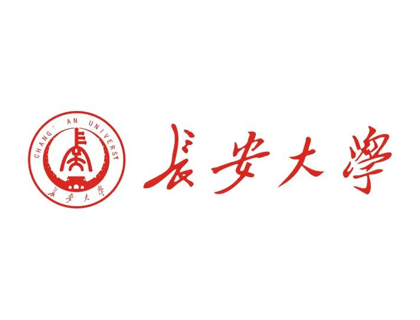
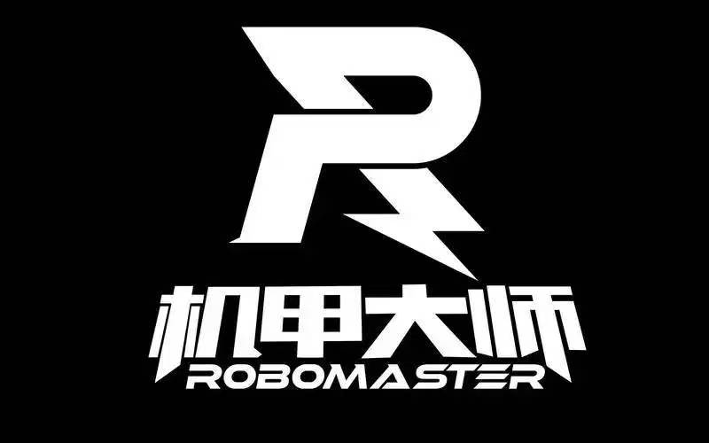

# 长安大学 雷达组 刘崇尘 个人仓库所有
## 修改中


<div align="center">
  <table border="0">
    <tr>
      <td align="center" valign="middle">
        
      </td>
      <td align="center" valign="middle">
        
      </td>
      <td align="center" valign="middle">
        
      </td>
    </tr>
  </table>
</div>

<h1 align="center">  AlwaysLC_Radar </h1>
<h3 align="center"> 长安大学 VGD 战队 · 雷达组核心框架 (Monorepo) </h3>

<p align="center">
  <strong>「  VGD 雷达组队内学习：包括雷达站机器人识别，无人机反制，无线电攻防 」</strong>
</p>

<p align="center">
  
  
  
  
</p>

---

## 📖 仓库导读 (Repository Overview)

本项目由 **长安大学雷达组成员 刘崇尘** 构建与维护，核心目的在于为 **VGD 战队雷达组** 提供一套标准化、模块化的全栈视觉与雷达综合控制学习框架。

本项目采用 **Monorepo（单体仓库）** 架构进行集中管理。
方便队内新老成员快速克隆、联合调试与技术迭代。

### 🧩 核心模块矩阵

| 模块分类 | 子项目 / 核心功能 | 核心技术栈 | 当前状态 |
| :--- | :--- | :--- | :---: |
| 👁️ **视觉系统** | 装甲板检测与数字分类网络 | `YOLO`, `CNN`, `PyTorch` | 🟢 稳定 |
| 📡 **雷达系统** | Pluto SDR 信号收发与波形解析 | `SDR`, `PyQt UI可视化` | 🟡 迭代中 |
| 🔌 **硬件驱动** | 海康工业相机底层控制 | `MvImport`, `C/C++` | 🟢 稳定 |
| 🎯 **控制算法** | 目标连续追踪与二维云台预测逻辑 | `ByteTrack`, `PID 控制` | 🟡 迭代中 |
| 🛡️ **底层通信** | 裁判系统数据交互与 CRC 校验 | `串口通信`, `Python struct`| 🟢 稳定 |

---

## 📸 综合运行展示 (Showcase)

<div align="center">
  <table>
    <tr>
      <td align="center" valign="top">
        
        <br>
        <p align="center"><strong>图1: 视觉算法处理流</strong></p>
      </td>
      
      <td align="center" valign="top">
        
        <br>
        <p align="center"><strong>图2: 雷达动态可视化 UI</strong></p>
      </td>
      
      <td align="center" valign="top">
        
        <br>
        <p align="center"><strong>图3: 硬件系统运行状态</strong></p>
      </td>
    </tr>
  </table>
</div>

---

## 📂 全局目录结构 (Directory Structure)

```text
HKR_RACE/
├── config/              # ⚙️ 统一配置中心 (相机参数、模型路径、串口号等 yaml 文件)
├── driver/              # 🕹️ 硬件驱动层 (海康相机、裁判系统底层封装)
├── interface/           # 💻 交互展示层 (实时雷达波形动态展示 UI)
├── model/               # 🧠 算法模型层 (目标检测、分类器及推理引擎)
├── tracker/             # 🎯 运动学追踪 (装甲板连续帧匹配与预测算法)
├── utils/               # 🛠️ 通用工具箱 (日志记录、CRC 校验算法等)
├── docs/                # 📁 静态资源库 (存放 Markdown 文档所需的本地图片)
├── main.py              # 🚀 调度入口 (多进程/多线程主程序)
└── requirements.txt     # 📦 全局环境依赖清单
```

---

## 🚀 快速部署指南 (Quick Start)

请队内成员严格按照以下步骤在工控机或本地开发环境中部署本系统。

### 1. 获取完整代码库

```bash
# 克隆主分支代码到本地
git clone [https://github.com/AlwaysLC/HKR_RACE.git](https://github.com/AlwaysLC/HKR_RACE.git)
cd HKR_RACE
```

### 2. 配置环境依赖

强烈建议使用 `Conda` 创建隔离的虚拟环境，防止与其他队员的环境冲突：

```bash
# 创建并激活 Python 3.10 虚拟环境
conda create -n vgd_radar python=3.10 -y
conda activate vgd_radar

# 安装核心依赖
pip install -r requirements.txt
```

> **⚠️ 硬件驱动额外提示**：
> 运行前，请务必确保测试平台已正确配置 **海康威视 MVS 客户端** 以及 **Pluto SDR USB 驱动**。缺少底层 C/C++ 动态链接库会导致程序闪退。

### 3. 一键启动

硬件连接无误后，直接运行主脚本拉起所有进程：

```bash
python main.py
```

---

## ⚖️ 队内开源许可与版权声明 (Internal License)

<div align="center">
  <h3>© 2026 长安大学VGD战队雷达组 刘崇尘. 保留所有权利.</h3>
</div>

本项目为 **长安大学 VGD 战队雷达组** 内部所有，旨在为队内成员提供学习、研究与赛前调试的基础。

**✅ 鼓励的行为：**
1. **队内学习与研究**：欢迎且强烈建议队内视觉组成员、电控组成员克隆本代码，研究雷达 SDR 解算逻辑、二维云台控制以及裁判系统底层通信的实现细节。
2. **优化与 PR**：如果在测试中发现了 Bug，或者有更高效的滤波/跟踪算法，非常欢迎在本地修改后向主分支提交 Pull Request (PR)。

**❌ 严禁的行为 ：**
1. **代码外泄**：严禁以任何形式将本仓库的核心源码、包含敏感参数的配置文件外传给其他高校战队或非本队人员。
2. **商业化与私用参赛**：未经作者及 VGD 战队的明确同意，严禁将本代码库用于非 VGD 名义的任何商业盈利或外包赛事项目。

