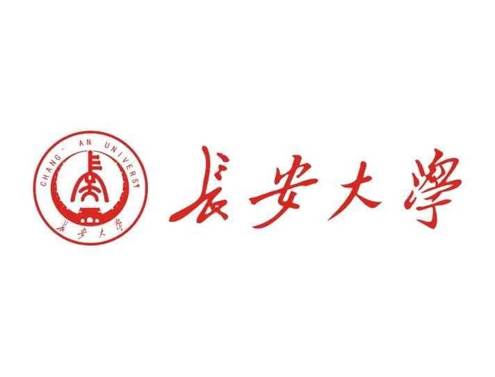

# 长安大学 VGD战队 雷达组 刘崇尘 个人仓库(更新中)


<div align="center">
  <table border="0">
    <tr>
      <td align="center" valign="middle">
        
      </td>
      <td align="center" valign="middle">
        
      </td>
      <td align="center" valign="middle">
        
      </td>
    </tr>
  </table>
</div>

<h1 align="center">  AlwaysLC²_Radar </h1>
<h3 align="center"> 长安大学 VGD 战队 · RM2026 雷达站三大子系统 (Monorepo) </h3>

<p align="center">
  <strong>「 目标识别 · 无人机反制 · 无线电攻防 」</strong>
</p>

<p align="center">
  
  
  
  
</p>

---

## 雷达站系统总览

RM2026 赛季雷达站由三个独立子系统组成，分别运行在三个终端中：

```
┌─────────────────────────────────────────────────────────┐
│                     RM2026 雷达站                         │
├───────────────┬──────────────────┬──────────────────────┤
│  识别系统      │   无线电系统      │   无人机反制系统       │
│  HKR_RACE     │ PinyRadio-sim    │      AntiDrone        │
│  (终端1)       │  (终端2)         │     (终端3)           │
├───────────────┼──────────────────┼──────────────────────┤
│ • 装甲板检测   │ • GFSK 解调      │ • 传统视觉           │
│ • 车辆检测     │ • 密钥破解        │ • 云台追踪             │
│ • 裁判系统通信 │ • 信息波/干扰波   │ • 激光瞄准             │
│ • 场地定位     │ • ZMQ 数据桥接    │ • 串口控制             │
│ • 密码学对抗   │                  │                       │
├───────────────┼──────────────────┼──────────────────────┤
│ 相机: CS060   │ 硬件: SDR 7020+9363│   相机: CS060          │
│ 模型: YOLO+CNN│ 频率: 红方/蓝方   │   传统视觉配置        │
└───────────────┴──────────────────┴──────────────────────┘
```

| 子系统 | 路径 | 语言/框架 | 核心功能 |
|:---|:---|:---|:---|
| 识别系统 | `~/HKR_RACE` | Python, PyTorch, YOLO, PyQt5 | 机器人识别、裁判系统通信、密码学对抗、比赛数据面板 |
| 无线电系统 | `~/PinyRadio-simulation` | Python, GNU Radio, ZMQ | GFSK 解调、密钥提取、干扰波发送、监控 UI |
| 无人机反制 | `~/LaserTracking-2026-main` | C++17, TensorRT, CUDA, OpenCV | 云台控制、激光打击、串口协议 |

---

## 快速启动

详见 `~/RADAR_启动命令.txt`，一键复制粘贴即可。

### 终端1：识别系统 (HKR_RACE)

```bash
start_conda
conda activate HKR
cd ~/HKR_RACE
export QT_QPA_PLATFORM_PLUGIN_PATH=/home/vgd/anaconda3/envs/HKR/lib/python3.10/site-packages/PyQt5/Qt5/plugins
python main.py --config config/params.yaml --device_config config/device.yaml
```

### 终端2：无线电系统 (PinyRadio-simulation)

```bash
cd ~/PinyRadio-simulation
bash start_radio.sh              # 默认: 干扰波(密钥), ZMQ→5556
bash start_radio.sh both         # 双模式: 广播+干扰
FACTION=blue bash start_radio.sh # 蓝方
```

### 终端3：无人机反制系统 (LaserTracking)

```bash
cd ~/LaserTracking-2026-main
bash run.sh                      # 真实云台
bash run.sh --test               # 测试模式 (虚拟串口)
bash run.sh --no-show            # 无GUI
```

---

## 子系统详解

### 1. 识别系统 (HKR_RACE)

**功能**：
- 装甲板检测与数字识别（YOLO 两阶段 + MobileNet 分类器）
- 车辆检测与追踪（ByteTrack + CascadeMatchTracker）
- 裁判系统串口通信（UART 115200, SOF=0xA5, CRC8/CRC16）
- 密码学对抗（密钥猜测 RM2026/2026RM → 无线电破解密钥验证 → 己方密钥更新）
- 双倍易伤触发（DV 机制，飞镖目标 + 雷达指令）
- 近敌告警（己方机器人 3m 内有敌方时下发 0x0301/0x0225）
- 场地坐标计算（射线投影 + PnP）

**UI 界面**：
- 紧凑状态栏：裁判系统 ● / 相机 ● / 无线电 ● / 阵营 / FPS / 密钥 / 加密等级 / DV 次数
- 比赛数据面板 CompetitionPanel：通信链路、密码学对抗、双倍易伤、标记+飞镖、无线电接收

**配置文件**：
- `config/params.yaml` — 模型路径、检测阈值、裁判系统串口、相机内参
- `config/device.yaml` — 相机设备激光雷达设置

### 2. 无线电系统 (PinyRadio-simulation)

**运行逻辑**（红方视角）：
- 己方基座发射源包含**对方**信息 → 收听红方广播源 433.200 MHz + 红方干扰源
- GFSK 解调（SPS=52, SR=1MHz, BT=0.35）→ 提取 0x0A01~0x0A06 数据帧
- 0x0A06 密钥帧 → ZMQ PUB → HKR_RACE 的 radio_bridge 接收
- HKR_RACE 通过裁判系统 0x0121 指令验证密钥（password_cmd=2）或更新己方密钥（password_cmd=1）

**数据链路**：

```
PlutoSDR → GFSK解调 → 帧解析 → ZMQ PUB (tcp://*:5556)
                                      ↓
                              HKR_RACE RadioBridge (ZMQ SUB)
                                      ↓
                              referee_comm._process_radio_key()
                                      ↓
                              裁判系统 0x0121 指令
```

**关键参数**：
| 参数 | 红方广播源 | 红方一级干扰源 |
|:---|:---|:---|
| 中心频点 | 433.200 MHz | 432.200 MHz |
| 带宽 | 0.54 MHz | 0.94 MHz |
| 功率 | -60 dBm | -10 dBm |
| Access Code | `0x2F6F4C74B914492E` (广播) | `0x16E8D377151C712D` (干扰) |

### 3. 无人机反制系统 (AntiDrone)

**两阶段检测流水线**（依据规则 5.6.3）：

```
相机 (1440×1080, 50fps)
    │
    ▼
Stage 1: best_fp16.engine(drone)  全图 GPU 推理
    │  conf=0.15, 找到无人机大致位置
    │
    ▼
裁剪: 以无人机 bbox 为中心, 各边扩展 50%
    │
    ▼
Stage 2: best_fp16(right).engine  局部 CPU 推理
    │  conf=0.3, 精确找到激光监测模块位置
    │  label = "module"
    │
    ▼
像素 → 角度 (P 控制器 + 速度前馈 + 阻尼)
    │
    ▼
串口 → 云台 → 激光连续照射 → P 值累加 → 锁定对方发射机构
```

**规则要点**（5.6.3 空中机器人被雷达反制）（青工会更新）：
| 参数 | 说明 |
|:---|:---|
| 被瞄准进度 P | 0→100, 中断即衰减 0.5/s |
| P 累加公式 | 第 n 个 0.1s: P = P + n |
| 首次锁定 P0=50 | ~1.0s 连续照射 |
| 二次锁定 P0=100 | ~1.4s 连续照射 |
| 三次锁定 P0=100 | 模块面积缩为 1/5, 不发光 |
| 锁定效果 | 对方发射机构锁定 45s |
| 单局上限 | 5 次 | 难度分别为 1 2 2 3 3 |

**GUI 界面**：
- 顶部半透明状态栏：FPS / 推理耗时 / 追踪目标类型 / 置信度 / 像素坐标
- 红色十字：激光 boresight 指向
- 绿色矩形框 + 圆心：检测结果 + 标签 (drone / module)
- 左下角：CMD (控制指令) / FB (云台反馈) / LOST (丢帧)
- 下方 4 个时序图：pitch/yaw 指令、像素误差、角速度、云台反馈

**串口协议**（22 字节）：
```
0xCD + pitch(f32) + yaw(f32) + pitch_rate(f32) + yaw_rate(f32) + timestamp(u32) + 0xDC
```

---

## 仿真测试

无需真实硬件即可验证完整链路。

```bash
# 终端1: 创建虚拟串口
socat -d -d pty,raw,echo=0,mode=666 pty,raw,echo=0,mode=666 &
# 记下输出: /dev/pts/3 和 /dev/pts/4

# 终端2: 裁判系统模拟器 → HKR_RACE
python3 ~/HKR_RACE/test_referee_sim.py /dev/pts/4 --faction red

# 终端3: 无线电数据模拟器 (ZMQ)
python3 ~/PinyRadio-simulation/test_radio_sim.py

# 终端4: HKR_RACE (裁判系统端口改为 /dev/pts/3)
conda activate HKR && cd ~/HKR_RACE && python main.py ...

# 无人机反制测试
cd ~/LaserTracking-2026-main && bash run.sh --test
```

预期：裁判系统 ● | 无线电 ● | 阵营红方 | 加密 Lv1 | DV 2/2 | 比赛数据面板计数持续增长

---

## 硬件配置

| 设备 | 用途 | 序列号/标识 |
|:---|:---|:---|
| 海康相机 ×2 | 识别 + 反制 | 硬件均为MV-CS060-10UC-PRO |
| PlutoSDR | 无线电收发 | USB 直连 |
| 云台 (两轴) | 激光指向 | 瓴控电机MS6015 |
| 裁判系统 CH341 | 串口通信 |
| 激光发射器 | 打击模块 | 由下位机控制通断 |

---

## 目录结构

```
~/
├── HKR_RACE/                       # 识别系统
│   ├── config/                     # params.yaml, device.yaml, botsort.yaml
│   ├── driver/                     # hik_camera/, referee/ (串口+无线电桥接)
│   ├── interface/                  # PyQt5 UI (CompetitionPanel)
│   ├── model/                      # YOLO 检测 + MobileNet 分类
│   ├── tracker/                    # CascadeMatchTracker
│   ├── transform/                  # 场地投影 / 射线追踪
│   ├── field/                      # 场地 .ply 模型 + 关键点
│   ├── main.py                     # 入口
│   └── test_referee_sim.py         # 裁判系统模拟器
│
├── PinyRadio-simulation/           # 无线电系统
│   ├── start_radio.sh              # 一键启动
│   ├── rx_competition.py           # 接收主程序
│   ├── radio_monitor.py            # 监控 UI
│   ├── test_radio_sim.py           # ZMQ 模拟器
│   ├── test_loopback.py            # 闭环 GFSK 验证
│   └── gr-gr_roboframe/            # GNU Radio OOT 模块 (GFSK 解调)
│
├── LaserTracking-2026-main/        # 无人机反制系统
│   ├── run.sh                      # 一键启动
│   ├── scripts/gimbal_simulator.py # 云台模拟器
│   └── src/
│       ├── detector/               # 两阶段检测 (TRT)
│       ├── control/                # 云台控制 (P+FF+D)
│       ├── hik_camera/             # 海康相机驱动 (GPU 去马赛克)
│       └── gimbal_serial/          # 云台串口协议
│
└── RADAR_启动命令.txt              # 三系统启动命令速查
```

---

## 队内开源许可与版权声明

<div align="center">
  <h3>© 2026 长安大学 VGD 战队雷达组. 保留所有权利.</h3>
</div>

本项目为 **长安大学 VGD 战队雷达组** 内部所有。

**✅ 鼓励：**
1. 队内学习与研究：欢迎克隆代码，研究 SDR 解算、云台控制及裁判系统通信实现
2. 优化与 PR：发现 Bug 或有更好的算法，欢迎提交 Pull Request

**❌ 严禁：**
1. 代码外泄：严禁将核心源码、含敏感参数的配置文件外传
2. 商业化与私用：未经作者及 VGD 战队同意，严禁用于非 VGD 名义的比赛或商业项目
